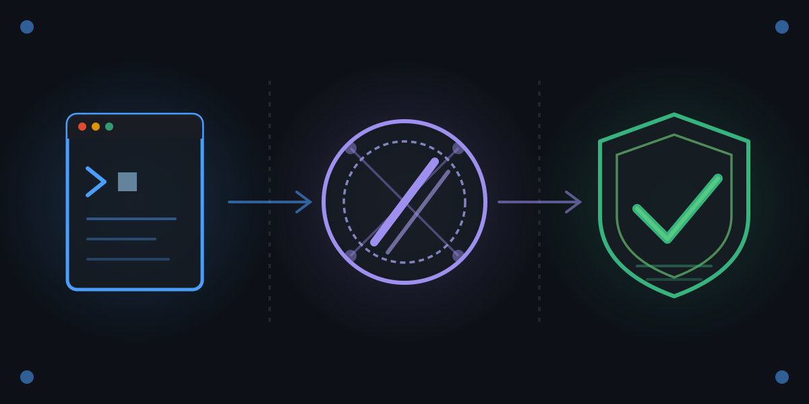

# claude-from-zero

<p align="center">
  
</p>

[](https://github.com/paiml/claude-from-zero/actions/workflows/ci.yml)
[](#license)
[](https://www.rust-lang.org/)
[](#install)

Companion repository for the **Claude from Zero** Coursera course —
course 9 of the [Rust for Data Engineering](https://www.coursera.org/specializations/rust-for-data-engineering)
specialization.

Trivial Rust demos that wire together the four pillars of the
production Claude workflow:

- **Claude Code** — the agent in your terminal
- **Skills** — reusable slash commands (`.claude/commands/`)
- **Sub-agents** — parallel delegated work via the Agent tool
- **Provable contracts + pmat** — the reliability layer

## Demos

| Crate | Course module | What it teaches |
|-------|---------------|-----------------|
| `m2-hello` | M2 · Claude Code fundamentals | First Rust function with a named provable contract, bootstrapped from `CLAUDE.md` |
| `m3-lint` | M3 · Skills (slash commands) | A crate with an intentional clippy warning that the `/lint-demo` skill catches |
| `m4-review` | M4 · Sub-agents and reliability | A kernel whose contract (`contracts/square-kernel-v1.yaml`) is validated by `pv` and reviewed by two parallel sub-agents |

Module 5 teaches `pmat query`, `pmat comply`, and `pmat hooks` applied
to this whole workspace — no extra crate needed; the repo itself is
the final demo.

## Prerequisites

Install the two external tools the demos wrap:

```bash
cargo install pmat             # Module 3 + 5: pmat query + pmat comply
cargo install provable-contracts  # Module 4: pv validate + pv status
```

## Quick start

```bash
# Compile all demos
cargo build --workspace

# M2 — run the provable contract at the binary level
cargo run -p m2-hello
# → contract: add is commutative, associative, has identity 0 — OK

# M3 — clippy catches the planted warnings
cargo clippy -p m3-lint

# M4 — validate the square-kernel contract (pv, the provable-contracts CLI)
pv validate contracts/square-kernel-v1.yaml
pv status   contracts/square-kernel-v1.yaml

# M4 — run the implementation governed by that contract
cargo run -p m4-review --bin diff-target -- 7
# → 49
# → contract: square-kernel-v1 holds for n=7 — non-negative, symmetric, overflow-safe — OK
```

## How the M4 sub-agent review works

1. The learner edits `m4-review/src/lib.rs` (a candidate implementation
   of `fn square(n: i32) -> Option<i32>`).
2. The learner asks Claude Code to spawn two parallel sub-agents via
   the Agent tool, each instructed to review the edit against
   `contracts/square-kernel-v1.yaml`.
3. Each sub-agent runs `/contract-demo` (which wraps `pv validate` +
   `pv status`), inspects the Rust source, and returns a verdict.
4. The parent rejects any verdict that contradicts a documented
   invariant. If both sub-agents approve, the diff ships.

The contract YAML is the single source of truth; the Rust
implementation, unit tests, and end-of-main `assert!` all restate
invariants named in the YAML.

## Go deeper

For real data-engineering work with this toolkit, continue with the
rest of the
[Rust for Data Engineering](https://www.coursera.org/specializations/rust-for-data-engineering)
specialization.

## Install

Clone the repo and build with stable Rust 1.75+:

```bash
git clone https://github.com/paiml/claude-from-zero
cd claude-from-zero
cargo build --workspace --locked
cargo test  --workspace --locked
```

Coverage (matches the CI gate at 100%):

```bash
cargo install cargo-llvm-cov  # one-time
cargo llvm-cov --workspace \
  --ignore-filename-regex 'main\.rs|src/bin/' \
  --fail-under-lines 100
```

Optional — the provable-contract validator and the PAIML compliance
checker the CI workflow runs:

```bash
cargo install aprender-contracts-cli  # provides `pv`
cargo install pmat                    # PAIML compliance toolkit
```

## License

Dual-licensed under MIT or Apache-2.0 — pick the one that fits your
downstream use. SPDX: `MIT OR Apache-2.0`.
